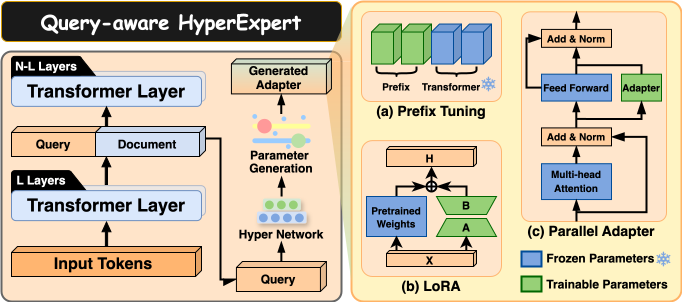

# IDEAL_Summary
**IDEAL: Leveraging Infinite and Dynamic Characterizations of Large Language Models for Query-focused Summarization**


## Getting Started

### 1. Installation
```bash
conda create --name ideal_summary python=3.9
conda activate ideal_summary
pip install -r requirement.txt
```
### Prepare pretrain model weights
Code prefixed with "LLama" are designed to work with the LLaMA 2 7B model weights. Similarly, code prefixed with "llama3" are compatible with the LLaMA 3 8B and LLaMA 3.1 8B model weights. You can obtain the official LLaMA consolidated format weights(Instruct version) by downloading them from the official Meta AI [website](https://www.llama.com/llama-downloads/) or the Hugging Face model [hub](https://huggingface.co/meta-llama/Llama-3.1-8B-Instruct/tree/main/original).

### 2. Data Processing

1. Download datasets from their respective official repositories:

    * [SQuALITY](https://github.com/nyu-mll/SQuALITY/tree/main/data/v1-3/txt)
    * [CovidET](https://github.com/honglizhan/CovidET/tree/main)
    * [QMSum](https://github.com/Yale-LILY/QMSum)

2. Preprocess the datasets using the provided Jupyter notebook: **`data_process.ipynb`**.

### 3. Training, Inference, and Evaluation

To train, run inference, and evaluate the model, execute the following script:

```
bash exps/finetuning_*_generate_evaluate.sh
```

For multi-reference Rouge scores and Bert-score evaluations on the SQuALITY dataset, use the notebook **`multi_reference_evaluation_SQuAlITY.ipynb`**.

### Results
The `output` directory includes the generated outputs of GPT-4o (2024-08-06) and our method on the test set reported in paper.

## Acknowledgment
Our project is developed based on the following repositories:

* [LLaMA-Adapter](https://github.com/OpenGVLab/LLaMA-Adapter)
* [llama-models](https://github.com/meta-llama/llama-models)